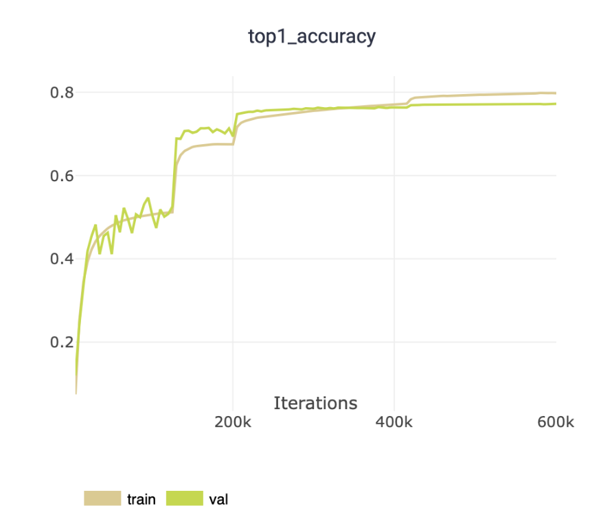

<h1 align="center"><b>ImageNet Training baseline with Pytorch Lightning</b></h1>

This repository is conducted from my experience when doing experiments on ImageNet dataset for my research works.

---

The training pipeline in [Deep Residual Learning for Image Recognition](https://www.cv-foundation.org/openaccess/content_cvpr_2016/papers/He_Deep_Residual_Learning_CVPR_2016_paper.pdf) is the main source of reference of this repository. In detail, the training configuration can be given in a short list below:

- CNN model: ResNet50 (from torchvision without pretrained)
- Image size: 224x224
- Training Batch size: 256
- Optimizer: SGD with learning rate 0.1, weight decay 1e-4 and momentum 0.3
- LRScheduler: ReduceLROnPlateau
- Total epoch: 120
- Training data augmentation can be checked on [`main.py`](./main.py) file
- Test Scheme: TenCrop test on five different scales in which each prediction is made of the ensemble of crops. Detail also can be checked on [`main.py`](./main.py) file

I use ClearML as a cloud logging service so anyone can see the training progress in detail. The training experiment is at [link](https://app.clear.ml/projects/2286bf95c1a749f486d26e25acceb3df/experiments/f3d29611e0d7478daf65b953061e3113/output/execution). **Noted** that you have to regist your own ClearML account and signin to get access to the content.

<p align="center">
    
</p>

---

## **Usage**

### **Dependency**
This repositoy requires `python>=3.8`. All others python's dependencies are listed in [requirements.txt](./requirements.txt) file, so you can easily install by running this command below:

```bash
python3.8 -m pip install -r requirements.txt
```

### **Dataset**
This repository can be used for all image classification tasks by editing the `_setup_dataset` method of `ImageNetDataModule` class in [main.py](./main.py) file.

In case that you want to conduct experiment on the ImageNet dataset, I provide [setup_imagenet.sh](./tools/setup_imagenet.sh) script which will automatically download the dataset and set the images into their correspond class and subset folder. To use the script, first you should navigate to the directory where you want to put it in, then execute the script. For example, I want to put the dataset in the `./data` directory:

```bash
mkdir ./data
cd ./data
bash /path/to/setup_imagenet.sh
```

### **Training**
You can check the [train.sh](./train.sh) for an example of training command.

Thanks to Pytorch Lightning, we can easily access to many great training techniques such as Distributed Parallel Processing (DPP) or Mixed Precision Training.

```bash
> python main.py fit -h

Runs the full optimization routine.

optional arguments:
  -h, --help            Show this help message and exit.
  -c CONFIG, --config CONFIG
                        Path to a configuration file in json or yaml format.
  --print_config[=flags]
                        Print the configuration after applying all other arguments and exit. The optional flags
                        customizes the output and are one or more keywords separated by comma. The supported
                        flags are: comments, skip_default, skip_null.
  --seed_everything SEED_EVERYTHING
                        Set to an int to run seed_everything with this value before classes instantiation.Set to
                        True to use a random seed. (type: Union[bool, int], default: True)
  --use_clearml {true,false}
                        Whether to use ClearML or not (type: bool, default: null)
  --clearml_project_name CLEARML_PROJECT_NAME
                        ClearML Project name (type: str, default: null)
  --clearml_task_name CLEARML_TASK_NAME
                        ClearML Task name (type: str, default: null)

Customize every aspect of training via flags:
  --trainer CONFIG      Path to a configuration file.
  --trainer.logger.help CLASS_PATH_OR_NAME
                        Show the help for the given subclass of Logger and exit.
  --trainer.logger LOGGER, --trainer.logger+ LOGGER
                        Logger (or iterable collection of loggers) for experiment tracking. A ``True`` value
                        uses the default ``TensorBoardLogger`` if it is installed, otherwise ``CSVLogger``.
                        ``False`` will disable logging. If multiple loggers are provided, local files
                        (checkpoints, profiler traces, etc.) are saved in the ``log_dir`` of he first logger.
                        Default: ``True``. (type: Union[Logger, Iterable[Logger], bool], default: True, known
                        subclasses: pytorch_lightning.loggers.logger.DummyLogger,
                        pytorch_lightning.loggers.CometLogger, pytorch_lightning.loggers.CSVLogger,
                        pytorch_lightning.loggers.MLFlowLogger, pytorch_lightning.loggers.NeptuneLogger,
                        pytorch_lightning.loggers.TensorBoardLogger, pytorch_lightning.loggers.WandbLogger)
  --trainer.enable_checkpointing {true,false}
                        If ``True``, enable checkpointing. It will configure a default ModelCheckpoint callback
                        if there is no user-defined ModelCheckpoint in
                        :paramref:`~pytorch_lightning.trainer.trainer.Trainer.callbacks`. Default: ``True``.
                        (type: bool, default: True)
  --trainer.callbacks.help CLASS_PATH_OR_NAME
                        Show the help for the given subclass of Callback and exit.
...
```